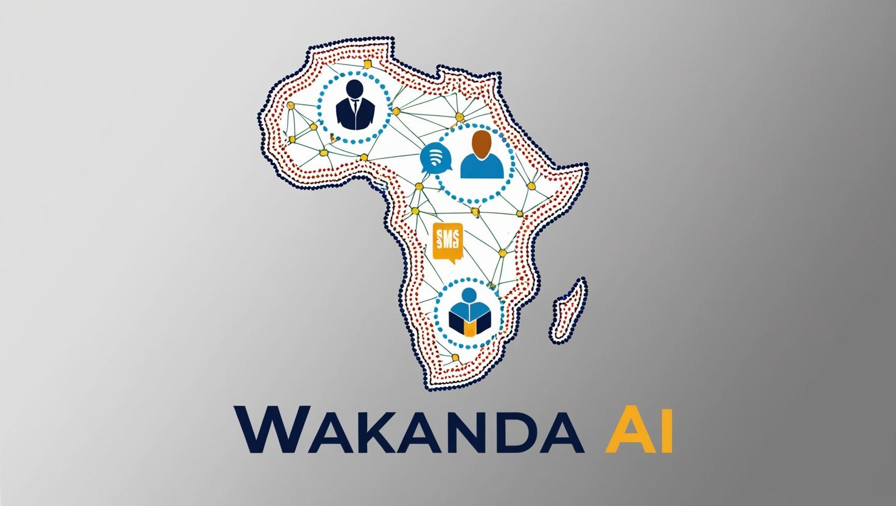
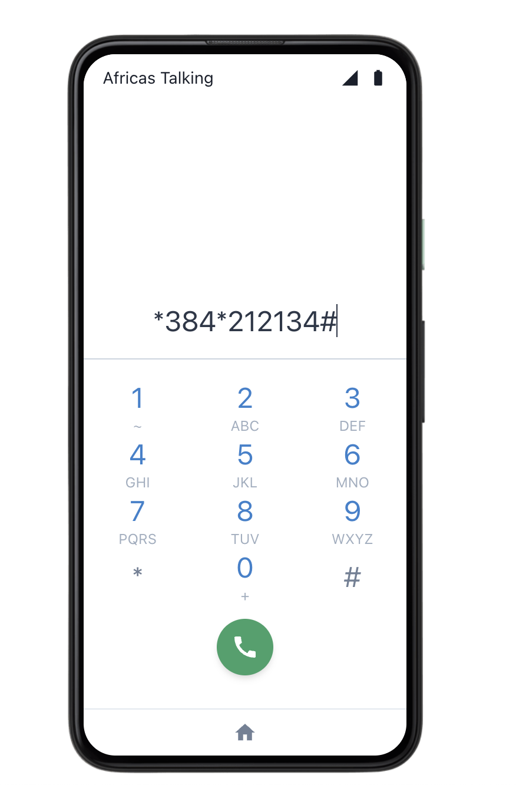
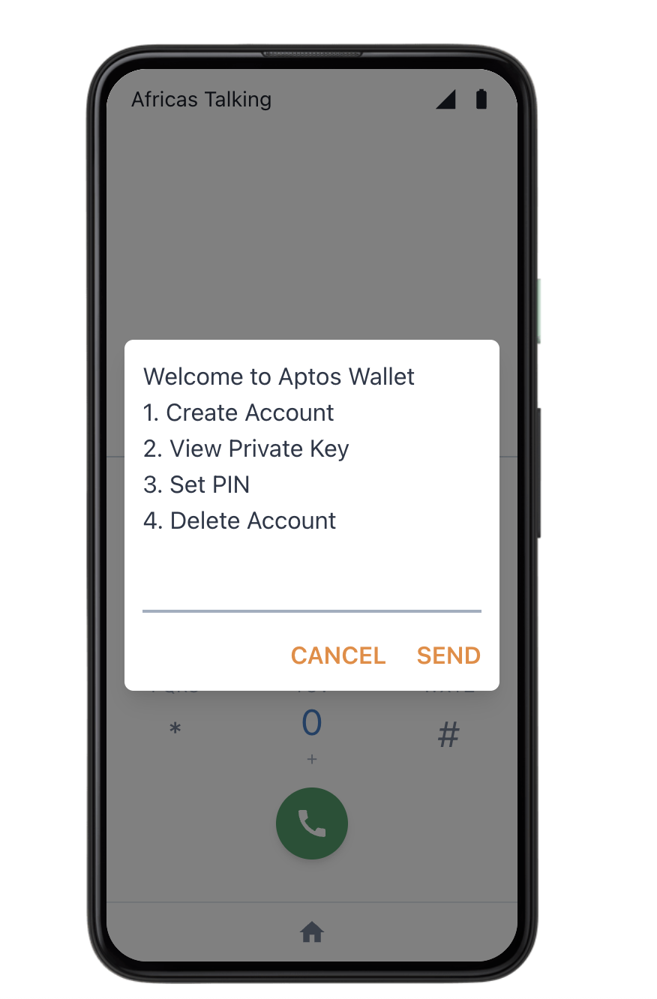
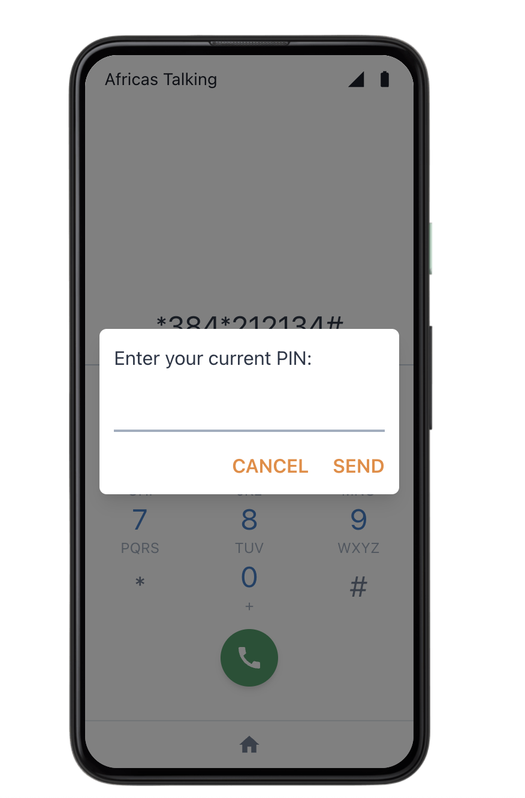
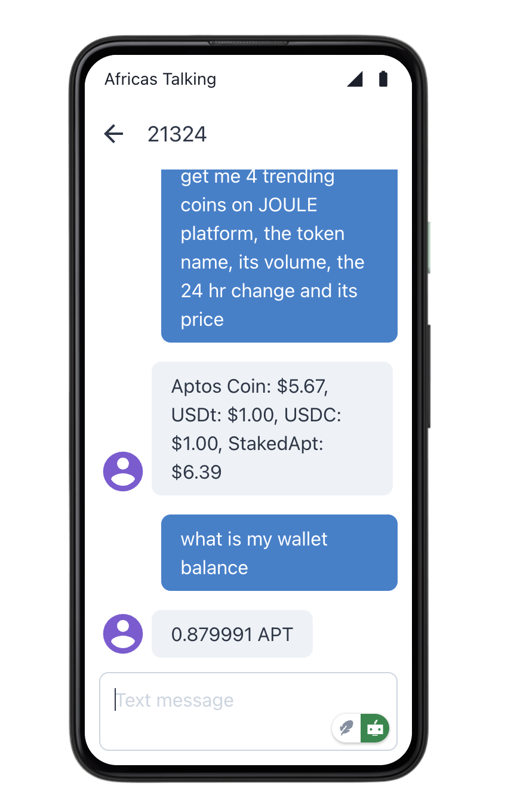
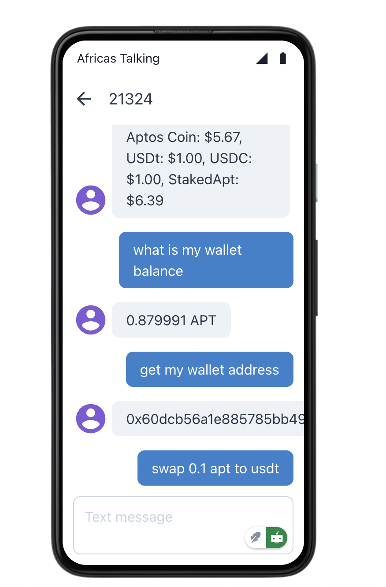

# Wakanda AI - Aptos Mobile Agent

  

A USSD and SMS-based blockchain interface that enables anyone with a basic mobile phone to interact with the Aptos blockchain in their preferred language (English, French, or Kiswahili). Built for Africa, it provides PIN-protected wallet management through USSD menus and natural language blockchain interactions via SMS.

## Background Story

The idea emerged when we realized that while blockchain technology holds immense potential for financial inclusion and economic growth in Africa, many Africans face barriers to entry due to technical complexity and language limitations. SMS, being widely used across the continent, presented itself as the perfect platform to democratize access to blockchain technology.

## Mission

To empower Africans by providing simple, accessible, and culturally relevant blockchain solutions through familiar communication channels, enabling everyone to participate in the digital economy regardless of their technical background or primary language.

## Vision

To become Africa's leading AI-powered blockchain interface, creating a future where every African can easily participate in the digital economy using their preferred local language.

    

    
    
    

## Key Features

- USSD menu for wallet management (create, view, secure, delete)
- Natural language SMS interactions with blockchain
- Multi-language support (English, French, Kiswahili)
- PIN-protected operations
- AI-powered response summarization
- Secure private key handling

 

    
    

## Tech Stack

- Move-AI-Agent kit
- Aptos Blockchain
- Claude 3.5 + GPT-3.5 (AI/ML)
- Express.js + TypeScript
- MongoDB Atlas
- Africa's Talking (SMS/USSD)

## Features

- 🤖 AI-powered blockchain interaction
- 📱 SMS and USSD integration
- 🌍 Multi-language support
- 💼 MOVE blockchain operations
- 🔒 Secure transactions
- 💬 Natural language processing

## Getting Started

### Prerequisites

- SMS and USSD enabled mobile phone

### Installation

1. Depending on your country, dial the relevant short code to start the USSD menu to set up your wallet and pin for the first time.
2. Once you have set up your wallet, you can now access your wallet and interact with the agent using SMS.

## Security

We prioritize the security of our users:

- End-to-end encryption
- No storage of private keys
- Regular security audits

## Roadmap

- [ ] Additional language support
- [ ] Integration with other blockchain networks
- [ ] Enhanced AI capabilities

## Contributing

We welcome contributions from the community! Please read our [Contributing Guidelines](CONTRIBUTING.md) for details on how to submit pull requests.

## Support

- Join our [Telegram Community](link)
- Follow us on [Twitter](link)
- Email: support@wakandaai.com

## License

This project is licensed under the [MIT License](LICENSE)

## Acknowledgments

- MOVE Blockchain team
- Our amazing community

---

Built with ❤️ for Africa 🌍
